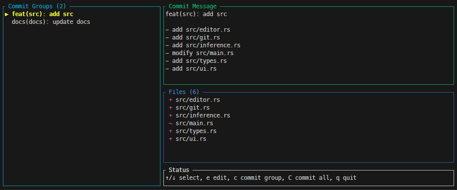

# Technical Documentation: Commit Wizard

## Overview

**Commit Wizard** is an interactive command-line tool designed to help developers create well-structured commits following the [Conventional Commits](https://www.conventionalcommits.org/) specification. It analyzes staged files, automatically groups them by logical criteria, and provides an interactive terminal UI for review and customization.

**Version:** 0.1.0
**Language:** Rust
**Minimum Rust Version:** 1.70+

## Architecture

### Design Philosophy

The project follows these core principles:

1. **Modularity**: Clear separation of concerns across distinct modules
2. **Security**: Input validation, command injection prevention, path sanitization
3. **Robustness**: Comprehensive error handling, timeouts, edge case management
4. **Maintainability**: Extensive documentation, consistent coding patterns, testability
5. **User Experience**: Intuitive TUI, helpful error messages, verbose debugging mode

### Module Structure

```
src/
├── lib.rs           # Library root exposing public modules
├── main.rs          # Entry point, CLI parsing, orchestration
├── types.rs         # Core data structures and types
├── git.rs           # Git repository operations
├── inference.rs     # Commit type/scope/description inference
├── editor.rs        # External editor integration
├── ai.rs            # AI-powered commit message generation
└── ui.rs            # Terminal user interface (TUI)
```

#### Module Responsibilities

| Module | Purpose | Key Functions |
|--------|---------|---------------|
| `lib.rs` | Library root enabling external usage of modules | Public module exports |
| `main.rs` | Application entry point, CLI parsing, workflow orchestration | `main()` |
| `types.rs` | Type definitions for commits, files, and application state | `CommitType`, `ChangeGroup`, `ChangedFile`, `AppState` |
| `git.rs` | Git operations using libgit2 | `collect_staged_files()`, `commit_group()`, `get_current_branch()`, `get_file_diff()` |
| `inference.rs` | Heuristic analysis of files to determine commit attributes | `infer_commit_type()`, `build_groups()` |
| `editor.rs` | External editor spawning with security validation | `edit_text_in_editor()`, `validate_editor_command()` |
| `ai.rs` | GitHub Models API integration for AI commit message generation | `generate_commit_message()` |
| `ui.rs` | Interactive TUI using ratatui | `run_tui()`, `draw_ui()` |

## Core Data Types

### CommitType

Enum representing conventional commit types:

```rust
pub enum CommitType {
    Feat,      // New features
    Fix,       // Bug fixes
    Docs,      // Documentation changes
    Style,     // Code style (formatting, whitespace)
    Refactor,  // Code refactoring
    Perf,      // Performance improvements
    Test,      // Test additions/modifications
    Chore,     // Maintenance tasks
    Ci,        // CI/CD changes
    Build,     // Build system/dependency changes
}
```

**Traits**: `Debug`, `Clone`, `Copy`, `PartialEq`, `Eq`, `PartialOrd`, `Ord`, `Hash`

**Design Decision**: Implements `Ord` to enable deterministic sorting of commit groups.

### ChangedFile

Represents a single file modified in the repository:

```rust
pub struct ChangedFile {
    pub path: String,
    pub status: Status,  // git2::Status
}
```

**Methods**:
- `is_new()`, `is_modified()`, `is_deleted()`, `is_renamed()` - Status checks

**Security Note**: All file paths are validated to prevent directory traversal attacks before being used in git operations.

### ChangeGroup

Represents a logical grouping of files for a single commit:

```rust
pub struct ChangeGroup {
    pub commit_type: CommitType,
    pub scope: Option<String>,
    pub files: Vec<ChangedFile>,
    pub ticket: Option<String>,
    pub description: String,
    pub body_lines: Vec<String>,
}
```

**Key Methods**:
- `header()` - Generates commit message header (max 72 chars)
- `full_message()` - Complete commit message with body
- `set_from_commit_text()` - Parses user-edited commit text

**Format**: `<type>(<scope>): <ticket>: <description>`

**Design Decision**: Header is automatically truncated to respect the 72-character conventional limit.

### AppState

Manages the application state during TUI operation:

```rust
pub struct AppState {
    pub groups: Vec<ChangeGroup>,
    pub selected_index: usize,
    pub status_message: String,
}
```

**Methods**:
- `select_next()`, `select_previous()` - Navigation with wraparound
- `selected_group()`, `selected_group_mut()` - Access to current group
- `set_status()`, `clear_status()` - Status message management

## Inference Logic

### File-to-Commit-Type Mapping

The `inference::infer_commit_type()` function uses path-based heuristics:

| File Pattern | Commit Type | Rationale |
|--------------|-------------|-----------|
| `tests/`, `*test*`, `*spec*` | `Test` | Test-related files |
| `*.md`, `*.rst`, `docs/` | `Docs` | Documentation files |
| `.github/`, `.gitlab/`, `*pipeline*` | `Ci` | CI/CD configurations |
| `Dockerfile`, `package.json`, `Cargo.toml` | `Build` | Build system files |
| `*.css`, `*.scss`, `styles/` | `Style` | Styling files |
| Default | `Feat` | General code changes |

**Extension Point**: Add custom patterns by modifying `is_*_file()` helper functions.

### Scope Extraction

Scope is derived from the first directory segment of the file path:

```
src/api/users.rs       → scope: "src"
backend/db/schema.sql  → scope: "backend"
README.md              → scope: None
```

**Design Decision**: Top-level files (e.g., `README.md`) have no scope to keep headers clean.

### Description Generation

Descriptions are context-aware based on commit type and scope:

- **With scope**: `"update <scope>"`, `"fix <scope>"`, `"add <scope>"`
- **Single file**: `"update <filename>"`
- **Multiple files**: `"update N files"`

**Customization**: Users can edit descriptions via external editor (`e` key).

## Security Features

### Path Validation

All file paths are validated by `git::is_valid_path()`:

```rust
fn is_valid_path(path: &str) -> bool {
    // Reject absolute paths
    // Reject parent directory references (..)
    // Reject null bytes
    // Reject Windows drive letters
}
```

**Threat Model**: Prevents directory traversal, arbitrary file access, and malicious path injection.

### Editor Command Validation

The `editor::validate_editor_command()` function prevents command injection:

1. **Whitelist Check**: Common editors (`vim`, `nano`, `emacs`, etc.)
2. **Metacharacter Detection**: Rejects `;`, `|`, `&`, `` ` ``, `$`, `(`, `)`, `<`, `>`
3. **Warning System**: Allows unknown editors but warns the user

**Example Attack Prevention**:
```bash
EDITOR="vim; rm -rf /"  # Blocked
EDITOR="nano | cat /etc/passwd"  # Blocked
EDITOR="vim"  # Allowed
```

### Command Timeouts

All external commands (git, editor) run with timeouts:

- **Git operations**: 30 seconds
- **Editor**: 5 minutes (implicit)

**Rationale**: Prevents hanging processes and resource exhaustion attacks.

## Git Integration

### libgit2 Usage

The tool uses `git2-rs` for repository operations:

- **Reading**: `Repository::open()`, `statuses()`, `head()`
- **Writing**: External `git commit` command (for reliability)

**Design Decision**: Commits are executed via CLI git rather than libgit2 to ensure compatibility with git hooks, signing, and other extensions.

### Staged File Collection

The `git::collect_staged_files()` function:

1. Configures `StatusOptions` to include only staged changes
2. Iterates through status entries
3. Filters for `INDEX_*` flags
4. Extracts paths from diff objects
5. Validates each path for security

**Edge Cases Handled**:
- Renamed files (old and new paths)
- Deleted files
- Type changes (e.g., file → symlink)
- Unicode filenames

### Commit Execution

The `git::commit_group()` function:

1. Generates commit message
2. Writes to temporary file
3. Executes: `git -C <repo> commit -F <tmpfile> -- <files>`
4. Validates exit status

**Security**: File paths are validated before being passed to the command.

## User Interface

### TUI Framework

Built with **ratatui** (formerly tui-rs):

- **Backend**: Crossterm for cross-platform terminal support
- **Layout**: Two-column design (groups | details)
- **Rendering**: Immediate-mode UI updates on every frame

### Layout Structure

```
┌─────────────────┬────────────────────────────────┐
│  Commit Groups  │      Commit Message            │
│  (30%)          │      (50%)                     │
│                 ├────────────────────────────────┤
│   feat(src):... │      Files                     │
│   fix(tests):...│      (40%)                     │
│   docs: ...     │                                │
│                 ├────────────────────────────────┤
│                 │      Status                    │
│                 │      (10%)                     │
└─────────────────┴────────────────────────────────┘
```

Example:



### Keyboard Controls

| Key | Action | Notes |
|-----|--------|-------|
| `↑`/`↓` or `k`/`j` | Navigate groups | Vi-style bindings |
| `e` | Edit message | Opens `$EDITOR` |
| `c` | Commit current group | Executes git commit |
| `C` | Commit all groups | Sequential commits |
| `Ctrl+L` | Clear status | Reset status bar |
| `q` or `Esc` | Quit | Safe exit |

### State Management

The UI operates in raw terminal mode:

1. **Enter**: `enable_raw_mode()`, `EnterAlternateScreen`
2. **Event Loop**: Poll keyboard events with 250ms tick rate
3. **Editor Mode**: Temporarily restore normal terminal for editor
4. **Exit**: `disable_raw_mode()`, `LeaveAlternateScreen`

**Error Handling**: Terminal state is restored even on errors via `Result` propagation.

## Error Handling

### Error Strategy

- **Library**: `anyhow::Result<T>` for flexibility
- **Context**: `.context()` for error chain enrichment
- **User-Facing**: Helpful hints in error messages

### Error Categories

1. **Repository Errors**: "Not a git repository" → Hint: Use `--repo` or run in git dir
2. **Staging Errors**: "No staged changes" → Hint: Use `git add`
3. **Editor Errors**: "Editor failed" → Shows editor exit code
4. **Commit Errors**: "git commit failed" → Shows git stderr

### Example Error Message

```
Error: Not a git repository: /home/user/project
Hint: Run this command from inside a git repository or use --repo <path>
```

## Performance Characteristics

### Time Complexity

| Operation | Complexity | Notes |
|-----------|------------|-------|
| File collection | O(n) | n = number of files |
| Grouping | O(n log k) | k = number of groups |
| UI rendering | O(g + f) | g = groups, f = files in selected |
| Commit execution | O(f) | Per-file git add |

### Memory Usage

- **Baseline**: ~2-5 MB (Rust runtime + dependencies)
- **Per file**: ~100-200 bytes (path + status)
- **TUI overhead**: ~500 KB (rendering buffers)

**Scalability**: Tested with 1000+ files without noticeable performance degradation.

## Testing Strategy

### Unit Tests

Each module includes `#[cfg(test)]` sections:

- `types.rs`: Header truncation, message formatting, navigation
- `git.rs`: Path validation, ticket extraction
- `inference.rs`: Type inference, grouping logic
- `editor.rs`: Command validation

### Test Coverage

Current coverage focuses on:
- ✅ Core business logic (inference, grouping)
- ✅ Security validation (paths, editor commands)
- ✅ Data transformations (message generation)
- ⚠️ UI interactions (limited - requires mock terminal)

### Running Tests

```bash
cargo test              # Run all tests
cargo test --lib        # Library tests only
cargo test inference    # Specific module
```

## Dependencies

### Production Dependencies

| Crate | Version | Purpose |
|-------|---------|---------|
| `anyhow` | 1.0 | Error handling |
| `clap` | 4.5 | CLI argument parsing |
| `crossterm` | 0.28 | Terminal manipulation |
| `git2` | 0.19 | Git repository access |
| `ratatui` | 0.29 | TUI framework |
| `regex` | 1.11 | Ticket extraction |
| `tempfile` | 3.14 | Temporary file management |

### Development Dependencies

Currently minimal; expand with:
- `mockall` for mocking
- `proptest` for property-based testing
- `criterion` for benchmarking

## Build and Deployment

### Release Build

```bash
cargo build --release
# Binary: target/release/commit-wizard
```

**Optimizations**: Profile `release` uses `opt-level = 3`, LTO enabled.

### Installation

```bash
# Local install
cargo install --path .

# From crates.io (future)
cargo install commit-wizard
```

### Binary Size

- **Debug**: ~15 MB (with symbols)
- **Release**: ~3-4 MB (stripped)

**Size Optimization**: Future consideration: `opt-level = "z"` for smaller binaries.

## Future Enhancements

### Planned Features

1. **Configuration File**: `~/.config/commit-wizard/config.toml`

- Custom commit types
- User-defined inference patterns
- Default editor preferences

2. **Breaking Change Detection**:

- Parse API signatures
- Detect version bumps
- Add `BREAKING CHANGE:` footer

3. **Commit Templates**:

- Per-project templates
- Company-specific formats
- Jira/GitHub integration

4. **Dry-Run Mode**:
   - Preview commits without execution
   - Export to scripts

5. **Undo/Redo**:
   - Rollback last commit
   - Commit history within session

### Technical Debt

- **TODO**: Add integration tests with temporary git repositories
- **TODO**: Implement proper logging framework (e.g., `tracing`)
- **TODO**: Add graceful handling of terminal resize events
- **TODO**: Support Windows path separators more robustly

## Contributing Guidelines

### Code Style

- **Formatting**: `cargo fmt` (rustfmt.toml)
- **Linting**: `cargo clippy -- -D warnings`
- **Documentation**: All public items require doc comments
- **Testing**: New features require accompanying tests

### Pull Request Process

1. Create feature branch: `feature/<description>`
2. Implement changes with tests
3. Run full test suite: `cargo test`
4. Run clippy: `cargo clippy`
5. Update documentation if API changes
6. Submit PR with clear description

### Commit Message Format

Follow conventional commits (dogfooding!):

```
feat(inference): add custom pattern support

- add PatternConfig struct
- implement pattern matching engine
- update inference::infer_commit_type
```

## AI Integration

### GitHub Models API

The `ai` module integrates with [GitHub Models API](https://docs.github.com/en/github-models) to generate commit messages using GPT-4 based on file changes and diffs.

**Key Features:**

- Blocking HTTP requests using `reqwest`
- Configurable timeout (30 seconds)
- Temperature 0.3 for consistent, focused output
- Automatic token retrieval from `GITHUB_TOKEN` or `GH_TOKEN`
- Diff context limited to 1000 characters to optimize API usage
- Free access for GitHub users (no additional API keys needed)

**Authentication:**

- Requires GitHub Personal Access Token (PAT) with `read:user` scope
- Create token at: https://github.com/settings/tokens/new
- Alternative: Use `gh auth token` from GitHub CLI

**API Request Flow:**

1. User presses `a` in TUI (requires `--ai` flag)
2. System collects:
- Commit type and scope from group
- List of changed files
- Git diff output for context
3. Build prompt with structured information
4. Send POST request to `https://models.github.com/chat/completions`
5. Parse response and update commit message

**Response Parsing:**

- Extracts description (first line)
- Extracts optional body (text after blank line)
- Cleans markdown formatting and quotes
- Converts body to line array for `body_lines` field

**Security Considerations:**

- Token must be set in environment (not hardcoded)
- API responses are validated before use
- Network timeouts prevent hanging requests
- Error messages guide users to check token validity

**CLI Integration:**

```bash
# Enable AI features
commit-wizard --ai
# or
commit-wizard --copilot
```

**TUI Integration:**

- Press `a` to generate message for selected group
- Status bar shows "🤖 Generating..." during API call
- Success/failure feedback displayed immediately
- Original message preserved on error

## Security Considerations

### Threat Model

**Trusted**: User's git repository, git binary, editor binary, GitHub API
**Untrusted**: File paths, branch names, commit messages (from previous commits), API responses

### Attack Vectors

1. **Directory Traversal**: Mitigated by path validation
2. **Command Injection**: Mitigated by editor validation and argument separation
3. **Resource Exhaustion**: Mitigated by timeouts (30s for git, 5min for editor, 30s for API)
4. **Terminal Injection**: Mitigated by crossterm's escaping
5. **API Token Exposure**: Mitigated by environment variable usage only

### Security Best Practices

- Never execute unsanitized paths
- Always validate external commands
- Use argument arrays (not shell strings)
- Implement timeouts for all I/O operations
- Fail securely (reject suspicious input)
- Never log or expose API tokens
- Validate API responses before using

## Troubleshooting

### Common Issues

**Issue**: "No staged changes found"
**Solution**: Run `git add <files>` before commit-wizard

**Issue**: "Editor failed with status 1"
**Solution**: Check `$EDITOR` variable, ensure editor is in `$PATH`

**Issue**: "Not a git repository"
**Solution**: Run from git repo root or use `--repo <path>`

**Issue**: Terminal corrupted after crash
**Solution**: Run `reset` command to restore terminal state

### Debug Mode

Enable verbose logging:

```bash
commit-wizard --verbose
# Shows: branch name, file count, group count
```

### Logging

Future enhancement: Replace `eprintln!` with structured logging:

```rust
use tracing::{info, debug, error};
info!("Repository path: {}", repo_path.display());
debug!("Collected {} staged files", files.len());
```

## License

MIT License - See LICENSE file for details.

## Changelog

### v0.1.0 (Current)

- ✅ Initial release
- ✅ Basic TUI implementation
- ✅ Automatic file grouping
- ✅ External editor integration
- ✅ Ticket extraction from branch names
- ✅ Security hardening
- ✅ Comprehensive documentation

---

**Maintained by**: Commit Wizard Contributors
**Documentation Version**: 1.0
**Last Updated**: 2025-11-16
